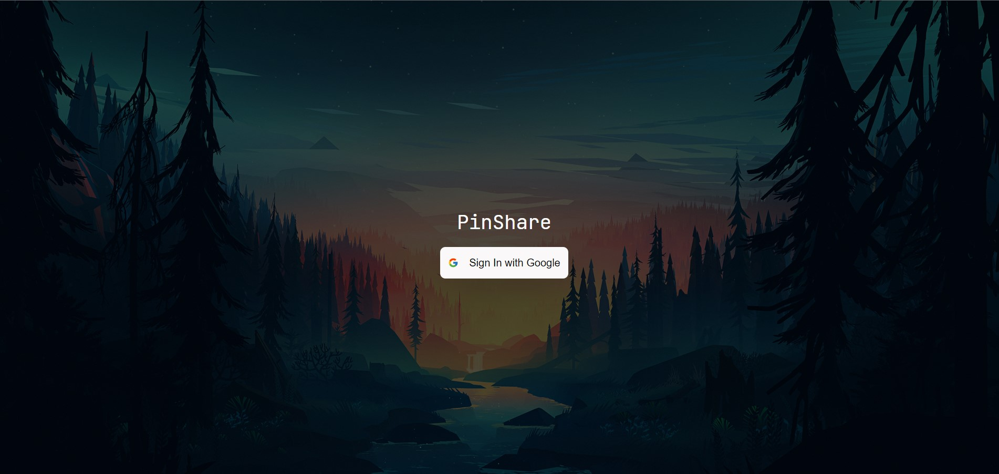
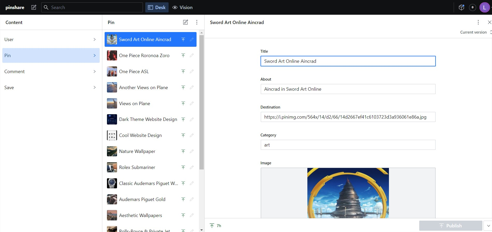

# PinShare

PinShare is an image based social media web application. It allows the users to login with their Google Account and share their ideas & posts to people. (Tutorial from [JavaScript Mastery](https://github.com/adrianhajdin))

### Screenshots

#### Login

#### Home

#### Backend

### Links

- Solution URL: [pinshare](https://github.com/imjunxian/pinshare)
- Live Site URL: [pinshare-demo](https://pinshare-demo.netlify.app/login)
